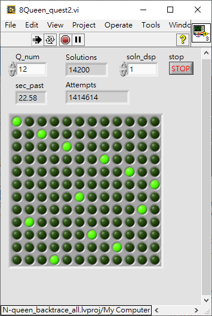

# LV_N-queen_backtrack

Solve N-queen for all solutions by backtrack.
Changed some bad coding style and did some improvement from v1 to v2.  
Elapsed time reduces from 249.24s to 22.58s when N=12.  

	
	

  
  
On my i7-4790 CPU @ 3.60GHz w/ 32G RAM PC,  
When N=13, it takes 3.73 minutes,  
and when N=14, it takes 41.12 minutes dramatically.  
They says performamce of backtrack is acceptable while N<20.  
But I can not reach that yet, N<=13 is acceptable now.  
  

	
	

  
  
